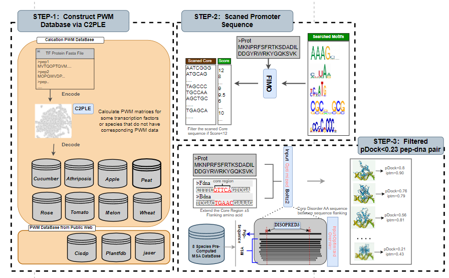

# BoltzScan

BoltzScan is a workflow for constructing gene regulatory networks based on Boltz1x_ODE (ODE, sampling_step=2) and motif scan.

## Overview

BoltzScan provides a comprehensive pipeline for gene regulatory network (GRN) inference, combining ODE-based modeling with motif scanning capabilities. The workflow is designed to help researchers understand transcriptional regulation mechanisms through systematic analysis of gene expression data and regulatory motifs.



## Features

BoltzScan consists of three main modules:

1. **Species-specific Motif Dataset Construction**
   - Build comprehensive motif databases tailored to specific species
   - Integrate known transcription factor binding motifs
   - Support custom motif library creation

2. **Motif Scan**
   - Scan genomic sequences for transcription factor binding sites
   - Identify potential regulatory elements
   - Score and rank motif matches based on statistical significance

3. **Boltz1x_ODE Inference**
   - Infer gene regulatory networks using ordinary differential equations
   - Implement Boltz1x_ODE model with configurable sampling steps (default: 2)(which refer to proteinx-mini)
   - Generate network topology and interaction strengths

## Installation

### Requirements

- Python 3.11+
- Required Python packages (see requirements.txt)
- Sufficient computational resources for large-scale motif scanning

### Setup

```bash
# Clone the repository
git clone https://github.com/yourusername/boltzscan.git
cd boltzscan

# Install required packages
pip install -r requirements.txt
