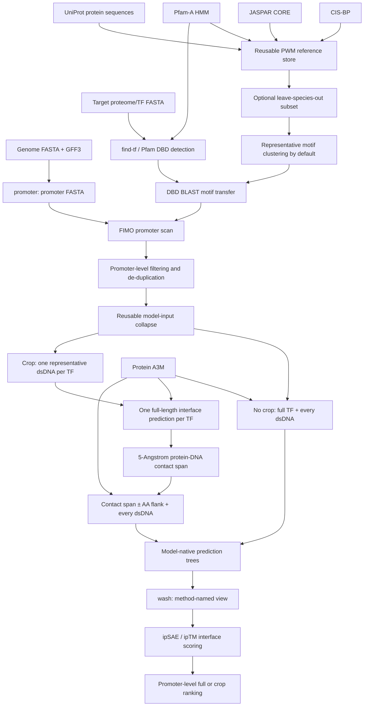

# BoltzScan 端到端流程、参数与可复现性说明

本文说明 BoltzScan 从参考 PWM 数据库、目标物种 TF 和启动子序列出发，到 FIMO 候选位点、full 以及可选 crop 蛋白–DNA 结构预测、`wash` 统一目录、ipSAE 打分和最终排序的完整流程。最后一部分用以下运行作为逐文件审计实例：

```text
tasks/hdzip/runs/hdzip_rcHm_v2_chr4g0398491_rosa_loso_20260802
```

文档审计日期为 **2026-08-06（Asia/Shanghai）**。仓库包版本为 `boltzscan 0.1.0`；审计时 Git `HEAD` 为 `2eee1ce73e49b788622811af77128d36d75dc1c0`，但工作区含未提交修改，因此仅记录 `HEAD` 不能完整复现当前实现。

## 1. 如何阅读本文中的参数和版本

本文区分四类信息：

| 标记 | 含义 |
|---|---|
| 代码默认 | CLI 或函数在未显式传参时采用的值 |
| 运行实值 | 已由输入 YAML、manifest 或日志明确记录的值 |
| 审计推断 | 可由产物数量、文件内容或时间戳唯一反推出的值 |
| 未记录 | 当前产物和源码均不足以确定，不能把当前软件环境或猜测当成历史事实 |

尤其要避免把“代码默认”误写为“某次运行实值”。HDZIP 实例的准备阶段没有统一的总 `run_manifest.json`，因此一部分准备参数只能由产物反推；Boltz2 推断参数则由 `inference_parameters.json` 和日志直接记录。

## 2. 框架解决的问题

BoltzScan 把两个层面的证据串联起来：

1. **sequence readout**：根据目标 TF 的 DNA-binding domain（DBD）与参考 TF DBD 的同源性，转移参考 PWM；再用 FIMO 在目标物种启动子中寻找候选结合位点。
2. **shape readout**：不启用 crop 时直接对全长 TF–dsDNA 候选建模；启用 crop 时，先对每个 TF 只做一次全长 TF–dsDNA 辅助推理，用预测接触界面确定 crop，再对所有 DNA 候选建模并以 ipSAE 重新排序。

FIMO 是候选门控，不是最终结构评分；结构预测也不会创造新的启动子候选。`interface` 辅助推理只用于定位裁剪边界，不映射到 promoter-level 也不参与排名。

## 3. 总体数据流



主命令把流程划分为三个阶段：

| 阶段 | 内容 | 是否需要 GPU |
|---|---|---:|
| `prepare` | LOSO、PWM 转移、FIMO、候选去重；不 crop 时写 full YAML，crop 时写每 TF 一个 interface YAML | 否 |
| `predict` | crop 模式先执行 `find-interface`，再推理所有 crop 候选；不 crop 时推理 full 候选；之后 `wash` | 是 |
| `score` | ipSAE、模型级到启动子级投影 | 通常否 |

`--stage all` 等价于按 `prepare → predict → score` 顺序运行，也可以只运行一个明确阶段。
prepare 成功后会把 `model`、`crop` 和 `seed` 固定写入 `RUN/run_config.json`；之后
执行 `boltzscan run --run RUN --stage predict` 或 `--stage score` 会自动恢复这些设置。

## 4. 三个容易混淆、但完全不同的概念

| 名称 | 操作对象 | 发生阶段 | 与 Boltz `processed/` 的关系 |
|---|---|---|---|
| `build-pwm-refs` 内部聚类 / `--no-pwm-cluster` | 参考 PWM | PWM 转移之前或之中 | 无关 |
| `--overlap-thresh` | 同一启动子、同一 TF 的 FIMO 核心区间 | 候选准备 | 无关 |
| Boltz `--override` | 已存在的结构预测目录 | 结构推断 | 只控制 prediction 是否重跑；不会强制重建 `processed/` |

因此：

- “scan 是否用了 cluster”默认答案是“是”；只有显式 `--no-pwm-cluster` 才允许原始 PWM。
- “overlap 怎么处理”指 FIMO 位点的启动子局部去重，不是 Boltz 模型参数，也不依赖 `processed/`。
- 如果用户说的是 Boltz 的 `override`，它和 `overlap` 只是拼写接近，语义没有关系。

## 5. 输入契约和标识符

### 5.1 TF FASTA

`--tf` 接收一个或多个蛋白序列。FASTA record ID 是全流程中的 `tf_name`，必须与：

- `tf2pwms.json` 的键；
- Pfam `domtblout` 的 target name；
- MSA 目录或 YAML 中的蛋白链；

保持一致。结构模型固定使用蛋白链 `A`。

### 5.2 promoter FASTA

`--promoters` 的每个 record ID 被直接解释为目标基因或目标启动子 ID，即结果中的 `sequence_name` / `TG`。ID 必须唯一，否则映射会产生歧义。

### 5.3 结构输入的固定链定义

每个模型输入包含三条链：

| 链 | 类型 | 内容 |
|---|---|---|
| `A` | protein | 全长 TF 或 DBD crop |
| `B` | DNA | canonical dsDNA 的一条链 |
| `C` | DNA | `B` 的 reverse complement |

`B` 的 canonical 规则为：

```text
canonical_dsdna = min(sequence, reverse_complement(sequence))
```

这里的 `min` 是字典序比较。它只用于合并完全相同或互为反向互补的结构计算，不会删除不同启动子上的生物学候选边。

## 6. 可选上游步骤：启动子提取与 TF 鉴定

### 6.1 从 genome + GFF3 提取 promoter

命令示例：

```bash
boltzscan promoter \
  --gff genes.gff3 \
  --genome genome.fa \
  --output promoters \
  --upstream 2000 \
  --downstream 200 \
  --format both
```

代码默认是上游 `2000 bp`、下游 `200 bp`。这里的锚点并非严格的转录本 TSS：

- 正链取该 gene group 中所有 CDS 的最小起点；
- 负链取所有 CDS 的最大终点；
- 没有 CDS、没有 gene feature 或链信息异常的记录被跳过。

输出序列按转录方向排列；上游部分大写、锚点及下游部分小写。靠近染色体边界时区间会被裁短。BED 使用 0-based、右开坐标；FASTA header 记录源码中的 1-based 基因组区间和 CDS anchor。

因此，若研究要求真正的转录起始位点或特定转录本 promoter，应在进入 BoltzScan 前准备经过验证的 promoter FASTA，而不能把默认 CDS anchor 当作真实 TSS。

### 6.2 从 proteome 中识别植物 TF

`find-tf` 的主要步骤是：

```text
hmmsearch --cut_ga --cpu <N> --domtblout pfam.domtbl -o /dev/null \
  plant_tf_pfam.hmm proteins.fa
```

随后按一个有顺序的 PlantTFDB-style 规则表分类：组合域规则先于单域规则，C2H2/C3H 等容易泛化的锌指规则放在最后；含转座元件相关 Pfam 的蛋白通常被排除，FAR1 是明确例外。当前 DBD allowlist 有 **45 个 Pfam base accession**。

该规则可把蛋白归到可由 Pfam 分辨的粒度，但不能可靠拆分所有植物 TF 亚家族，例如 NF-YB 与 NF-YC、部分 MYB-related 亚类、以及 `HB-other` 内的 HD-ZIP I/II 和 WOX。

## 7. 构建可复用 PWM 参考库

普通用户优先安装已经发布并校验过的运行时 reference 包：

```bash
boltzscan install-pwm-refs
```

该命令内置当前 Google Drive 发布链接和 SHA256，自动下载、校验并安装到
`data/pwms/_refs`。若该目录已有数据库，显式增加 `--replace`，旧目录会先被移动到
带时间戳的备份。发布包同时安装 70-profile 的植物 TF Pfam 精简库；普通用户不再需要
另行下载完整 Pfam-A。开发者测试其他发布包时仍可同时覆盖 `--url` 和 `--sha256`。

开发者更新数据库时运行：

```bash
boltzscan build-pwm-refs \
  --refs data/pwms/_refs \
  --pfam /path/to/Pfam-A.hmm \
  --cpu 8 \
  --archive dist/boltzscan_pwm_refs.tar.gz \
  --refresh
```

该开发者命令依次下载/更新来源、构建 DBD store、生成 representative PWM cluster，
最后写出运行时精简 `tar.gz` 和相邻 SHA256 文件。参考库只需安装或构建一次，后续
物种映射不联网。若核心文件和 cluster 已存在且没有 `--refresh`，代码直接复用并重新
打包。归档不包含原始下载缓存、日志、`pfam.domtbl` 和 `_cluster_work`。
完整 Pfam-A 仅作为维护者构建输入；命令会抽取规则实际依赖的 70 个 profile，并把
`pfam/plant_tf_pfam.hmm`、profile 清单及源文件/子集 SHA256 一同放入运行时发布包。

### 7.1 数据来源与版本策略

| 来源 | 当前实现 | 版本可追踪性 |
|---|---|---|
| CIS-BP | 固定下载路径含 `data/3_10/` | **CIS-BP 3.10** 可确认 |
| JASPAR | REST `api/v1/matrix/`，`collection=CORE`、`page_size=500` | 每个 matrix ID 自带版本，如 `MA1210.3`；没有固定全库 release |
| UniProt | 实时 UniProt REST；JASPAR 优先 accession FASTA，CIS-BP 用 DBID + species 搜索 top hit | 没有记录 UniProt release；结果缓存于 `uniprot_cache.json` |
| Pfam-A | 维护者提供完整 HMM；运行时只发布规则依赖的 70-profile 子集 | 子集 manifest 记录完整源文件和子集 SHA256、profile 数量与 accession 清单 |

CIS-BP 仅保留 `TF_Status == "D"` 且 `Motif_ID` 非空、非 `.` 的条目，再按 `DBID` 合并 motif。JASPAR 下载每个 CORE matrix 的详细 JSON 和 PFM。参考蛋白通过 UniProt 解析；解析失败会在缓存中保存空字符串，避免反复查询。

PWM 转为 MEME 文件时写入：

- `MEME version 5.5.0` 文件头；
- `nsites=100`；
- 均匀背景 `A=C=G=T=0.25`。

这里的 `MEME version 5.5.0` 是序列化文件头，不等同于实际运行的 Tomtom 或 FIMO 版本。

### 7.2 当前本地参考库快照

`data/pwms/_refs/build_manifest.json` 记录：

| 指标 | 数量 |
|---|---:|
| 原始 reference entries `n_refs` | 9,560 |
| 成功取得蛋白序列 | 8,663 |
| 未解析到序列 | 897 |
| allowlisted DBD records | 15,826 |

进一步由 `ref_index.tsv` 审计得到：

| 指标 | 数量 |
|---|---:|
| 含 DBD 的唯一 reference IDs | 5,848 |
| CIS-BP DBD rows / 唯一 refs | 8,002 / 2,666 |
| JASPAR DBD rows / 唯一 refs | 7,824 / 3,182 |
| 被索引引用的唯一 motif IDs | 10,595 |
| TF family 标签 | 127 |
| Pfam DBD accessions | 45 |
| species 字段的唯一原始值 | 119 |
| motif store 中 `.txt` 文件 | 17,601 |
| motif store 中 `.meme` 文件 | 16,145 |

motif store 文件数大于 `ref_index.tsv` 引用的 10,595 个 motif，因为 store 保留了更多下载/转换产物；下游只复制被映射且存在可扫描 MEME 文件的 motif。

关键快照 SHA256：

```text
ref_index.tsv       1078c7e5ba4cdc2ae5ce7dc9544320620726e78ce86a11700e124458393cc898
ref_dbd.fasta       3a7e5fbdc0934f820e7f8bcceb3436114029a67d4abfa4aa30e86d8e60d70443
build_manifest.json 794c2dc7da0e66f43344cbea32ecb7d57428a9f9632442d27b6b6743ddc1dbf8
motif_clusters.tsv  65107ffa9da18fbab93b176769f7a96b676f214ade9b7f38df2591a15d52087a
```

### 7.3 Pfam 快照

维护者输入与实际发布文件分开记录：

| 属性 | 完整维护者输入 | BoltzScan 运行时子集 |
|---|---:|---:|
| 文件大小 | 2,067,046,650 bytes | 3,176,655 bytes |
| HMM profiles | 27,481 | 70 |
| SHA256 | `a78a42d6faf265b6bfca59e8f062d06fae6083ce2c6e335d7b381f20b82b7903` | `266f14fc49d77b33f5b2ed02b1b1884ed863599855b89a7f0b67e02c002a998e` |

70 个 profile 是 `find-tf` family rules、DBD allowlist 和 TE 排除规则引用 accession
的精确并集；不参与任何规则的 Pfam 模型不会进入运行时搜索。manifest 同时保存完整
source 的 profile 数/SHA256 与子集 accession 清单，因此发布身份可验证。用 HDZIP
样本对完整库和子集运行 HMMER 3.4，规则相关 `PF00046.36` 命中的坐标完全相同。

## 8. Leave-species-out（LOSO）

LOSO 必须在 DBD BLAST 和 motif clustering **之前**发生：

1. 对 species 名称做 `_ → 空格`、case-fold 和连续空白归一化；
2. 对分号分隔的多物种字段逐项做精确匹配，不做模糊子串匹配；
3. 同时过滤 `ref_index.tsv` 和 `ref_dbd.fasta`；
4. 只复制 retained reference 所需的 PWM；
5. 如果同一个 motif ID 同时出现在 excluded 和 retained references 中，直接失败，以避免泄漏；
6. 不复制原库的 `motif_clusters.tsv`。

子集一旦创建便视为不可变；已有 `refs_loso/` 默认不覆盖。默认工作流会在 LOSO 子集上重新聚类，避免目标物种影响 representative 的选择；只有 `--no-pwm-cluster` 跳过。

LOSO 与 motif 输出模式正交，`map-pwm` 和统一 `run` 都支持下面四种组合：

| 参考范围 | 默认 cluster-rep | 显式 `--no-pwm-cluster` |
|---|---|---|
| 完整 reference | 输出 representative PWM | 输出全部原始 PWM |
| `--exclude-species` LOSO reference | 过滤后重新聚类并输出 representative PWM | 过滤后输出全部保留的原始 PWM |

## 9. DBD 检测与 PWM 转移

### 9.1 DBD 提取

目标 TF 与参考蛋白都用同一 Pfam-A 和同一 `hmmsearch --cut_ga` 规则。`domtblout` 中 Pfam accession 的版本后缀会被去掉；只保留 45 个 allowlisted DBD。

DBD 序列使用 envelope 坐标 `env_from`、`env_to`，为 **1-based、两端闭合**：

```text
dbd_seq = protein[env_from - 1 : env_to]
```

### 9.2 DBD BLAST

每次物种映射会先为参考 DBD 建立 BLAST protein DB，再运行：

```text
blastp -outfmt "6 qseqid sseqid pident length nident qlen slen" \
  -num_threads <cpu> -max_target_seqs 2000
```

通过条件为：

1. query 与 subject 的 base Pfam accession 完全相同；
2. alignment length 同时覆盖 query DBD 和 subject DBD 的至少 `min_cov`；默认 `min_cov=0.8`；
3. `pct_id = nident / alignment_length` 达到阈值。

默认是 family-specific 阈值，而非统一 70%。已显式校准的阈值如下；未列出的 allowlisted family 回退到 `0.70`。

| Family | 最低 DBD identity |
|---|---:|
| AP2 | 0.59 |
| B3, GRAS | 0.60 |
| MYB, NAC, LBD | 0.62 |
| WRKY, TCP | 0.66 |
| HSF | 0.67 |
| bHLH | 0.69 |
| Homeobox, bZIP, Dof, GATA, MADS, NF-Y, E2F, SBP, ZF-HD | 0.70 |
| C2H2 | 0.78 |

`--threshold-mode global --threshold X` 可改为统一阈值。审计环境的 BLAST+ 是 `2.17.0+`，build date `2025-08-11`。

### 9.3 motif 赋值

一个合格 reference DBD row 携带的全部 motif 都可转给 query TF。对每个 `(query TF, motif)` 只保留 identity 最高的 reference 作为报告证据。缺少可扫描 `.meme` 文件的 motif 不进入 `tf2pwms.json`。

输出包括：

```text
pwm/
├── pfam.domtbl
├── species_dbd.fasta
├── refdb.*
├── map_report.tsv
├── tf2pwms.json
├── txt/
└── meme/
```

## 10. motif clustering 到底做什么

参考库构建时的 motif clustering 是**参考 PWM 去冗余**，不是对目标 TF、DBD、FIMO 位点或结构结果聚类。

算法为：

1. 每个 motif 的 family 取携带它的参考 TF 中最常见的 family；
2. support 定义为携带该 motif 的不同 reference TF 数量；
3. 每个 family 单独合并成 MEME database；
4. 运行 `tomtom -text -no-ssc -thresh 0.05 query.meme target.meme`；
5. 按 support 从高到低、motif ID 从小到大遍历；
6. motif 若与已选 representative 直接相邻，则加入 support 最高的相邻 representative，否则自身成为新 representative；
7. 缺少 PWM 的 motif 为 singleton/self representative。

这是确定顺序的 greedy、直接邻接聚类，不是 transitive connected components。审计环境 Tomtom 为 `5.5.9`。

当前主参考库的结果是：

| 指标 | 数量 |
|---|---:|
| 输入/映射 motif | 10,595 |
| representative motifs | 2,925 |
| families | 127 |
| Tomtom q-value 阈值 | 0.05 |

默认映射会把原 motif ID 替换为 `representative_id`。`build-pwm-refs` 会生成、`install-pwm-refs` 会安装并验证 `motif_clusters.tsv`；只有显式 `--no-pwm-cluster` 才进入未聚类模式。

## 11. FIMO / cisTarget 扫描

### 11.1 扫描集合和背景

高层 `run` 会读取目标 TF FASTA，只扫描 `tf2pwms.json` 中映射给这些 TF 的 motif 并集。背景频率从完整 promoter FASTA 计算：

- 序列先转大写，`U` 转为 `T`；
- 只统计 `A/C/G/T`；
- ambiguity bases 不进入分母；
- 双链扫描时按 FIMO 的标准语义对称化为 `A=T=(A+T)/2`、
  `C=G=(C+G)/2`。

每个 motif 在正、负两条链上扫描。原始结果字段为：

```text
sequence_name,start,stop,strand,score,pvalue,qvalue,motif_id
```

官方 FIMO 坐标为 1-based、两端闭合；正负链均保持 `start <= stop`，
链方向由 `strand` 字段表达。后续过滤统一使用 `min(start, stop)` 和
`max(start, stop)`，因此也能读取旧结果。

### 11.2 扫描与过滤使用同一阈值

BoltzScan 将映射到当前 TF 的单 motif 文件合并为临时 MEME database，
然后调用 `doctor` 管理的官方 MEME Suite FIMO。关键参数固定并写入日志：

```text
fimo --bfile <promoter_background> --motif-pseudo 0.1 \
     --thresh <pvalue_thresh> --max-stored-scores 500000 --no-pgc \
     <mapped_motifs.meme> <promoters.fasta>
```

独立 `fimo-scan` 的默认阈值是 `1e-4`，高层 `run` 的默认阈值是 `1e-5`；
两者都会把各自选定的阈值同时用于 raw scan 和 promoter-level 候选过滤。
所有选中 motif 在同一次扫描中运行，因此 `qvalue` 是本次完整扫描集合上的
FIMO q-value；候选过滤使用的是 `pvalue`。

### 11.3 公开输出

FIMO 阶段不再生成辅助 score/ranking matrix，只公开三张 CSV：

1. `raw_fimo_scan_res.csv`；
2. `filtered_promoter_scan_level_res.csv`；
3. `filtered_model_scan_level_res.csv`。

## 12. promoter-level 候选过滤与 overlap

候选准备首先执行：

```text
pvalue <= pvalue_threshold
```

然后 motif→TF 映射可能把一行展开为多个 TF；只保留 TF FASTA 中存在蛋白序列的 TF。

### 12.1 坐标和建模 DNA

先把 FIMO core 转成 0-based、右开区间：

```text
core_start = min(start, stop) - 1
core_stop  = max(start, stop)
```

再向两端增加 `dna_flank`，默认各 `5 bp`，并裁到 promoter 边界：

```text
real_start = max(core_start - dna_flank, 0)
real_stop  = min(core_stop + dna_flank, promoter_length)
DNA        = promoter[real_start:real_stop]
```

因此 promoter 边界附近的实际 DNA 可以短于 `motif_width + 2 × dna_flank`。

### 12.2 去重优先级

所有 hits 先按以下顺序稳定排序：

```text
pvalue 升序 → PWM score 降序 → promoter/start/stop/strand/motif_id 升序
```

之后只在同一 `(sequence_name, tf_name)` 中去重：

1. 对完全相同的 `extracted_motif_seq` 只保留优先级最高的一行；
2. 依照上述顺序 greedy 接受 FIMO core 区间；
3. 对当前候选区间计算它和任何已接受区间的正 overlap；
4. 若 `overlap_length / current_core_length > overlap_threshold`，当前行冗余。

默认 `overlap_threshold=0.0`，所以任何正长度 core overlap 都删除后到的 hit；端点相接但 overlap 为 0 的位点保留。分母是“当前候选 core 长度”，规则是非对称的；判断使用严格 `>`，因此阈值为 `1.0` 时没有 hit 会因 overlap 被删除。

这个参数完全在 FIMO 后处理阶段执行，**不读取、不依赖 Boltz `processed/`**。

### 12.3 稳定 ID

`candidate_id` 是以下字段以 NUL 分隔后做 SHA256，再取前 20 个十六进制字符：

```text
tf_name, motif_id, sequence_name, start, stop, strand, extracted_motif_seq
```

格式为 `candidate_<20 hex>`。

## 13. 从生物学候选到可复用结构任务

候选过滤完成后，才按以下 key 合并结构计算：

```text
(tf_name, canonical_duplex(extracted_motif_seq))
```

`model_id` 同样是稳定 SHA256 前 20 位，格式为 `model_<20 hex>`。两张过滤表的职责不同：

| 文件 | 一行代表什么 | 用途 |
|---|---|---|
| `filtered_promoter_scan_level_res.csv` | 一个保留的 promoter–TF–site 候选，并带 `model_id` | 生物学候选全集与回投映射 |
| `filtered_model_scan_level_res.csv` | 一个唯一 TF + canonical dsDNA 结构任务 | GPU 计算队列 |

相同 DNA 出现在不同 promoter 时，candidate 行全部保留；它们可以共享同一个 `model_id`。不能把 model-level 表当作 GRN edge 表。

## 14. full 和 interface-crop 输入

### 14.1 full arm

`full` 使用 TF FASTA 中的完整蛋白序列和候选 dsDNA。

### 14.2 interface 辅助 arm 与 crop arm

显式传入 `--crop N` 时，`prepare` 为每个 TF 从 model-level 候选中选择一条代表 dsDNA，写入 `inputs/interface/`。`find-interface` 对这些全长复合物各推理一次，把蛋白质与 DNA B/C 链任一重原子距离不大于 5 Å 的残基定义为接触界面。然后以接触残基的 bounding span 加 flank 生成所有候选的 `crop<N>`：

```text
interface_start = min(protein-DNA contact residues)
interface_stop  = max(protein-DNA contact residues)
crop_start = max(1, interface_start - N)
crop_stop  = min(protein_length, interface_stop + N)
```

所有坐标都是 1-based、两端闭合；Python 切片为 `protein[crop_start-1:crop_stop]`。每个 crop 使用它原本 FIMO 候选的 `B/C` DNA。如果某 TF 缺少辅助预测或没有可解析的接触残基，流程明确失败，不会悄悄回退到 HMMER DBD 或 full。

`inputs/interface_boundaries.csv` 记录每个 TF 的接触区间和证据 CIF；`crop_manifest.csv` 记录 boundary source、蛋白长度、crop 起止、flank 和裁剪 MSA。HMMER DBD 仍用于 PWM 转移，但不再决定结构 crop。

## 15. MSA 与 Boltz2 YAML

### 15.1 通用 YAML

带 MSA 的 Boltz2 输入形如：

```yaml
version: 1
sequences:
  - protein:
      id: [A]
      sequence: MGDY...
      msa: /absolute/or/resolvable/path/0.a3m
  - dna:
      id: [B]
      sequence: TCCATACAATGATTGAACGAA
  - dna:
      id: [C]
      sequence: TTCGTTCAATCATTGTATGGA
```

原生 Boltz parser 有自己的 MSA 兼容路径，但 BoltzScan 的生产协议更严格：
`boltz1`、`boltz2`、`boltz1_ode`、`boltz2_ode` 的 preflight 均要求每条蛋白质
具有本地 A3M/CSV，并验证 query 与 YAML 蛋白质序列完全一致。

### 15.2 当前高层工作流行为

`boltzscan run --stage prepare` 会根据模型家族准备 MSA：所有 Boltz 家族模型自动生成或复用 `RUN/msa/`，ESMFold2 允许 `msa: empty`。因此：

- 对 ESMFold2，可按单序列模式使用 YAML；
- 对所有 Boltz 家族模型，高层 prepare 自动物化带 A3M 的 `inputs/full`（不 crop）或 `inputs/interface`（crop 模式）；
- `find-interface` 同步裁剪蛋白序列与 A3M，并把裁剪 A3M 写在 `inputs/crop<N>/msa/`，不覆盖 `RUN/msa/` 中的全长 MSA。

裁剪对应关系写入 `crop_manifest.csv`；最终 YAML 中的 `msa` 路径和
`inference_parameters.json` 共同记录推理 provenance。

### 15.3 内置 MSA server 客户端

通用 `boltzscan msa` 调用：

```bash
boltzscan msa --fasta <protein.fasta> --output <msa_dir>
```

该命令直接调用兼容的远端 MSA HTTP 服务，不再安装、导入或执行 Protenix。
一个多记录 FASTA 会生成 `<msa_dir>/<protein_id>/0.a3m`；标识符中的非字母数字
字符替换为 `_`。匹配的已有 A3M 会复用，查询序列不匹配则停止。`--jobs`
控制并发请求数，`--server-url` 可切换兼容服务；默认端点也可由
`BOLTZSCAN_MSA_SERVER_URL` 设置。生产工作流写 `RUN/msa.log`，下载压缩包和
其他服务端中间结果均不保留。

HDZIP full MSA 留下的 `msa.sh` 明确记录：

| 数据库 | 标识 |
|---|---|
| UniRef | `uniref30_2103_db` |
| template sequence DB | `pdb70_220313_db` |
| environmental DB | `colabfold_envdb_202108_db` |

可见执行行还包含 `--use-templates 1` 和 `--db-load-mode`。脚本中虽定义了 `num-iterations=3`、`-e 0.1`、`max-seqs=10000` 等 shell 变量，但这些变量没有出现在保留的最终 `colabfold_search` 调用参数中，因此本文不把它们声称为已确认实值。

### 15.4 crop A3M

`find-interface` 使用预测接触区间加 flank 得到 1-based inclusive
蛋白区间。`crop_a3m_file()` 将该区间转换为
0-based half-open query 残基区间后：

1. query 的大写非 gap 字符才计入蛋白残基坐标；
2. 先定位对应 A3M alignment columns，再同步裁剪所有 records；
3. 保留裁剪区内部的小写 insertion，不把它们误算为蛋白坐标；
4. 保留最后一条有效 record，只删除裁剪后全 gap 的非 query records；
5. 原子写入 crop input 目录所有的 `msa/tf_<hash>.a3m`；
6. crop YAML 的 protein sequence 与裁剪 A3M query 必须完全一致。

`crop_manifest.csv` 记录 interface 区间、实际 crop 坐标和 `crop_msa_path`。

## 16. 结构推断及原生目录

### 16.1 预测方法名

统一发布根目录由 engine/model 决定：

| 推断方式 | 统一根目录 |
|---|---|
| ESMFold2 | `esmfold2_prediction/` |
| Boltz-1 | `boltz1_prediction/` |
| Boltz-2 | `boltz2_prediction/` |
| Boltz1 ODE | `boltz1_ode_prediction/` |
| Boltz2 ODE | `boltz2_ode_prediction/` |

拼写统一为 `prediction`。

### 16.2 原生目录优先

推断首先完全遵循模型自己的目录：

```text
Boltz:     RUN/boltz_results_<input-dir-stem>/
ESMFold2:  RUN/esmfold_results_<input-dir-stem>/
```

例如 input dir 名为 `full`，Boltz 原生结果就是：

```text
RUN/boltz_results_full/
├── inference_parameters.json
├── processed/
├── predictions/
├── lightning_logs/
└── msa/
```

BoltzScan 不应在推断阶段强迫两个模型使用同一种原生布局。统一目录是之后由 `wash` 发布的视图。

### 16.3 BoltzScan wrapper 参数

低层命令：

```bash
boltzscan predict \
  --input-dir INPUT \
  --output RUN \
  --model boltz2 \
  --seed 42
```

wrapper 还会附加：

```text
--write_full_pae
```

用户直接通过 `--model {esmfold2,boltz1,boltz2,boltz1_ode,boltz2_ode}` 选择模型，不再分别
选择 engine 和 model。除适用于所有模型的可选 `--seed` 外，不公开科学推断参数。
BoltzScan 的 wheel 同时携带固定的 Boltz 2.2.1 和 ESM 推理源码及其许可证；
GPU、模型依赖和权重仍由独立的 `boltz`、`esmfold2` 环境提供。vendored Boltz
保持与上游 v2.2.1 一致，并不直接认识 `_ode` 模型名；`_boltz_worker.py`
负责将 `_ode` 映射到对应底座并仅注入下列 ODE 参数。因此标准模型不会受到
ODE 补丁影响，安装后的行为也不依赖机器上另一份 Boltz 源码。

内部按模型分流：

| model | wrapper 行为 | 有效 sampling steps | 有效 step scale |
|---|---|---:|---:|
| `boltz1_ode` | Boltz1 checkpoint + BoltzScan ODE protocol | 2 | 1.0 |
| `boltz2_ode` | Boltz2 checkpoint + BoltzScan ODE protocol | 2 | 1.0 |
| `boltz1` | 不传 sampling/step-scale override | 原生默认 200 | 原生默认 1.638 |
| `boltz2` | 不传 sampling/step-scale override | 原生默认 200 | 原生默认 1.5 |

ODE adapter 只替换所选底座的 diffusion 参数，其余组件跟随对应模型族：

| model | checkpoint / model class | preprocessing / DataModule | Pairformer / paired MSA |
|---|---|---|---|
| `boltz1_ode` | `boltz1_conf.ckpt` / `Boltz1` | Boltz1 | V1 / 否 |
| `boltz2_ode` | `boltz2_conf.ckpt` / `Boltz2` | Boltz2 | V2 / 是 |

`inference_parameters.json` 记录有效数值和来源。Boltz1、Boltz2 不接受
sampling/step-scale override；高层和低层入口遵循同一规则。

Boltz 2.2.1 的其他未覆盖配置包括：

| 参数 | wrapper 下的有效值/行为 |
|---|---|
| recycling steps | 3 |
| diffusion samples | 1 |
| output format | mmCIF |
| maximum MSA sequences | 8,192 |
| paired MSA feature | Boltz2 启用 |
| precision | Boltz1 / Boltz1 ODE 为 float32；Boltz2 / Boltz2 ODE 为 `bf16-mixed` |
| devices | 原生默认 1 |
| accelerator | 原生默认 GPU |

Boltz2 和 Boltz1 遵守各自原生 sampler 默认值；2-step ODE 采样只属于
`boltz1_ode` 和 `boltz2_ode` 的 BoltzScan 策略。seed 默认不传，由原生入口决定；用户显式提供
`--seed` 时五种模型都会收到该 seed。`--write_full_pae` 只控制必需的附加输出，
不改变采样过程。

原来的 `-pt/--preprocessing-threads` 是进入神经网络之前解析 YAML、构建特征和
缓存的 CPU 线程数；现在内部自动设置为当前进程可用的 CPU 核数，并尊重 Linux
CPU affinity。原来的 `-nw/--num-workers` 是推理 DataLoader 的 CPU worker
进程数：它为 GPU 准备/搬运 batch，但不是 GPU 数量，也不会增加 GPU 算力。
worker 过多可能增加内存占用或造成 CUDA 卡顿，因此内部固定为 2。两者都不再
作为用户参数暴露。

`--subsample_msa` 在 vendored CLI 中是 `is_flag`；wrapper 没有传该 flag，因此实际命令行路径不启用 subsampling，尽管函数签名和 help 文案中存在“默认 True”的不一致。输入 A3M 仍先受 `max_msa_seqs=8192` 上限约束。

### 16.4 ESMFold2 参数

BoltzScan 将公开的本地调用入口 `ESMFold2InputBuilder.fold()` 作为 ESMFold2 的原生推断接口。未显式传参时，wrapper 不再向 worker 或 `fold()` 注入推断参数，其有效默认值是：

| 参数 | `fold()` 默认 | BoltzScan 默认行为 |
|---|---:|---|
| `num_loops` | 3 | 不传 override，3 |
| sampling steps | 200 | 不传 override，200 |
| diffusion samples | 1 | 不传 override，1 |
| seed | `None` | 不传 override，`None` |

checkpoint `config.json` 本身保存 `num_loops=3`、`num_diffusion_samples=32` 和 `structure_head.inference_num_steps=14`；直接调用底层 `model.forward()` 而不传参数会读取这些 config 值。但本项目使用的公开本地入口是 `ESMFold2InputBuilder.fold()`，其函数默认 3/200/1，因此本文中的“ESMFold2 原生默认”特指这个实际入口。vendored README 中的 50-step 调用是显式示例 protocol，也不是函数默认值。

显式传入 `--seed` 时，vendored `ESMFold2InputBuilder.fold()` 会同时固定
Python、NumPy、Torch 和 CUDA RNG，启用 deterministic algorithms，关闭 TF32，
并使用确定性的 cuBLAS workspace。这样在相同 GPU、CUDA、PyTorch、源码与权重下，
源码 API 与 BoltzScan wrapper 的 mmCIF 坐标、PAE、pLDDT 和 confidence 可逐值复现；
退出 seed context 后恢复调用方原有的 RNG 和 backend 设置。不传 seed 时不启用这些
约束，维持 ESMFold2 原生的非确定性行为。不同硬件或软件版本之间不承诺 bitwise 一致。

worker 若 YAML 中 `msa` 指向存在的 A3M 则加载；`msa: empty` 则不加载 MSA。每个预测写出 mmCIF、PAE、pLDDT 和 confidence JSON；四项都存在时跳过该模型。ESMFold2/ESMC 权重位置可分别由 `BOLTZSCAN_ESMFOLD2_WEIGHTS` 和 `BOLTZSCAN_ESMC_WEIGHTS` 覆盖；本地 ESMFold2 目录中的 `ccd.pkl` 会被自动选中。三者的 resolved location 会写入 `inference_parameters.json`，但当前尚未在每次运行中重新计算大型 checkpoint 的 SHA256，因此跨机器复现时仍应通过发布方 checksum 固定权重身份。

## 17. Boltz `processed/`、恢复和 `override`

### 17.1 `processed/` 包含什么

Boltz 先把输入解析为模型可直接读取的缓存：

```text
processed/
├── manifest.json
├── records/       每个 target 的结构/链元数据 JSON
├── structures/    tokenized structure inputs
├── msa/           解析和截断后的 MSA NPZ
├── constraints/   约束 NPZ；无显式约束时也会有每 target 文件
├── templates/     有模板时存在内容
└── mols/          每 target 的 molecule pickle
```

这些是原生 Boltz 可恢复执行的一部分，不应在 `wash` 时删除或移动。

### 17.2 缓存键和风险

当前 preprocessing 只用输入文件 stem / record ID 判断是否已处理：

```text
若 processed/records/<yaml-stem>.json 已存在，则跳过同 stem 输入。
```

它不会重新计算并核对 YAML 内容 hash。因此：

- 原 YAML 内容未变、只缺一部分 predictions：可以在同一原生目录恢复；
- YAML 的蛋白、DNA、MSA 路径或 MSA 内容变了，但文件名没变：**不能**相信原 `processed/`；
- 这种输入变更应使用新的 run/input-dir stem 或新的原生结果目录，并重新 preprocess；
- 仅加 `--override` 不够，因为 `override` 只控制已有 prediction 是否重跑，不会使同名 processed record 失效。

### 17.3 正常恢复推断

不加 `--override` 时，Boltz 会扫描 `predictions/`，跳过已存在的 prediction directory，只跑缺失 model。这个路径适合进程中断后的续跑。

加 `--override` 时会重跑已有 predictions，但仍复用 `processed/`。只有确定输入内容没变、只是想用同一 processed input 重采样时才安全。

### 17.4 为什么 overlap 不依赖 processed

`--overlap-thresh` 在 YAML 和 `model_id` 创建之前已经完成。Boltz 只看到最终唯一结构任务，不知道哪些 FIMO hit 因 overlap 被删除。因此改变 overlap 会改变候选和 YAML 集合，应创建新的准备/推断目录；它不是从旧 `processed/` 动态计算的参数。

## 18. `wash`：保留原生目录并统一发布

命令示例：

```bash
boltzscan wash --run RUN --model boltz2
boltzscan wash --run RUN --model boltz2 --mode hard
```

`wash` 自动发现 `boltz_results_* / predictions` 或 `esmfold_results_* / predictions`，再发布到 method-named root。

### 18.1 soft，默认

- 为每个 arm 创建相对目录软链接；
- 原生推断继续写入时，统一视图实时更新；
- 已指向正确 source 的链接可安全复用；
- 不接受 destination 已是无关路径的情况。

### 18.2 hard

- 创建真实目录；
- 同文件系统优先逐文件 hard link；
- 跨文件系统或权限/文件系统不支持时 `copy2`；
- 已有相同文件复用，发现不同数据则拒绝覆盖；
- 原生 source 始终保留。

因此 `hard` 是一个可刷新的物化 snapshot，不是 destructive move。推断仍在运行时，hard view 只包含执行 `wash` 当时已有的文件；需要再次运行才能刷新。soft view 是 live 的。

### 18.3 manifest

`wash_manifest.json` 记录 schema、UTC 时间、engine/model、mode、每个 arm 的 source/destination、文件/目录数和可找到的 inference metadata。soft 链接虽然会继续增长，manifest 内的计数是生成 manifest 时的 snapshot，不会自动更新。

## 19. ipSAE 和结构排序

### 19.1 ipSAE 计算

bundled `ipsae.py` 是 version 3，日期 `2025-04-06`。每个结构调用：

```text
python ipsae.py <PAE> <CIF> 10 10
```

即 PAE cutoff `10 Å`、distance cutoff `10 Å`，产出 `<cif-stem>_10_10.txt`。已有该文件时默认复用；`--force` 才重算。

对固定链 `A/B/C`，主分数为：

```text
AB = max(A→B, B→A)
AC = max(A→C, C→A)
ipsae = min(AB, AC)
```

这样先对每条 DNA 链做方向对称化，再取两条链中较弱的一条；DNA–DNA 界面不参与主分数。Boltz pair ipTM 使用同样的聚合逻辑。另保存最保守的四方向最小值、global ipTM、ipTM 差异和 pDockQ 等诊断指标。

### 19.2 从 model 回投 promoter

ipSAE 先对 `filtered_model_scan_level_res.csv` 的唯一 `model_id` 计算，再通过 promoter-level 表中的 `model_id` many-to-one join 回所有 candidate。一个模型被 98 个 promoter 候选共享时，结构只算一次，但 98 个候选都获得该分数。

### 19.3 候选排名与兼容的三臂比较

三个排名使用完全相同的 candidate universe：

| arm | 主排序键 | tie-breaker |
|---|---|---|
| FIMO-only | p-value 升序 | PWM score 降序，再按生物学 ID/坐标稳定排序 |
| full | full ipSAE 降序 | FIMO p-value、PWM score、稳定字段 |
| crop | crop ipSAE 降序 | FIMO p-value、PWM score、稳定字段 |

没有未经校准的 FIMO/ipSAE 加权和。`rank_gain = fimo_rank - structure_rank`，正数表示结构证据把候选向前提升。另在每个 promoter 内给出 target-site rank。

输出文件名使用实际模型，例如 `fimo_plus_boltz2_scored.csv` 和
`fimo_plus_crop<N>_boltz2_scored.csv`；模型身份仍同时记录在 prediction root
和 `inference_parameters.json` 中。

`ipsae` 对实际存在的候选 arm 生成 model-level 和 promoter-level 结果。
当前生产流程二选一：只有 full，或只有一个 crop arm；`interface`
辅助 arm 不打分。三臂表仅为兼容旧的 full+crop 对照运行而保留。

## 20. 标准运行目录和复用边界

```text
RUN/
├── refs_loso/                    可选、不可变 LOSO 快照
├── pwm/                          DBD、BLAST 证据、tf2pwms、实际扫描 motif
├── scan/
│   ├── raw_fimo_scan_res.csv
│   ├── filtered_promoter_scan_level_res.csv
│   └── filtered_model_scan_level_res.csv
├── inputs/
│   ├── full/                    仅不 crop 模式
│   ├── interface/               crop 模式，每 TF 一个辅助 YAML
│   ├── interface_boundaries.csv crop 模式的接触区间
│   └── crop<N>/                 crop 候选、裁剪 A3M 和 manifest
├── run.log                       最近一次高层命令日志，重复运行时覆盖
├── map-pwm.log                   PWM 映射步骤日志
├── fimo-scan.log                 promoter 扫描步骤日志
├── msa.log                       Boltz 模型的 MSA 步骤日志
├── fimo2yaml.log                 结构输入生成步骤日志
├── find-interface.log            crop 模式：辅助推理与接触解析
├── predict-full.log              仅不 crop 模式
├── predict-crop<N>.log           仅 crop 模式
├── wash.log                      预测发布步骤日志
├── ipsae.log                     评分步骤日志
├── boltz_results_<arm>/          Boltz 原生；arm 为 full/interface/crop<N>
├── esmfold_results_<arm>/        或 ESMFold2 原生目录
├── <method>_prediction/          wash 发布层
│   ├── full/                    不 crop 模式
│   ├── interface/               crop 模式辅助预测
│   ├── crop<N>/                 crop 模式候选预测
│   └── wash_manifest.json
└── results/                      当前候选 arm 的 model/promoter-level 结果
```

`--resume` 主要复用 PWM/FIMO 准备产物：

- 已有 LOSO subset 必须显式 `--resume` 才复用；
- 已有 raw FIMO 可复用，promoter/model 两层会依当前过滤参数重建；
- full 或 interface/crop YAML 依当前 model-level 表重建。

改变以下任一内容时，推荐新建 run directory，而不是在旧目录上混用：目标 TF 序列、promoter FASTA、参考库快照、excluded species、cluster policy、FIMO/candidate threshold、overlap、DNA flank、interface crop flank、MSA 或结构模型。

## 21. HDZIP / rose LOSO 实例审计

### 21.1 输入与当前状态

运行目录：

```text
tasks/hdzip/runs/hdzip_rcHm_v2_chr4g0398491_rosa_loso_20260802
```

目标 TF：

| 属性 | 值 |
|---|---|
| ID | `RcHm_v2.0_Chr4g0398491` |
| 描述 | `Rosa chinensis|HD-ZIP|HD-ZIP family protein` |
| 长度 | 228 aa |
| FASTA SHA256 | `540bae41b2985afe8d3f05115756601f4d5a28325f74e89c29ee0fa62d76f557` |

promoter FASTA：

| 属性 | 值 |
|---|---:|
| records / unique IDs | 45,464 / 45,464 |
| 总长度 | 100,016,973 bp |
| 长度范围 | 675–2,200 bp |
| 非 A/C/G/T bases | 642 |
| SHA256 | `076aa48c75eb1100dfdc7f5bc53ce1ff59b9eb75aec14dc036927c3462ada8e2` |

run name 和 record ID 显示为 RchiOBHm/Rosa 数据，但当前运行目录没有保存原 genome、GFF 的版本 manifest 或 checksum，因此不能仅凭名称严谨确认 genome assembly/annotation release。

最初的 Boltz2 运行错误地强制使用了 `sampling_steps=2`、`step_scale=1.0`。该 full arm 后来完成 10,436 个 prediction，crop20 只完成 5,501 个 preprocessing records、尚无 prediction。2026-08-06 这套结果连同原 soft-wash 视图被完整移入 `native_history/boltz2_sampling_steps_2_step_scale_1_seed_42/`，仅供 provenance 和方法比较，不能与替代运行混合。

替代运行于 **2026-08-06 18:10 +08:00** 启动，使用 Boltz2 原生 sampling/step-scale 默认值；先运行 full，再运行 crop20，最后执行 soft `wash`。full 的 10,436 个输入已重新 preprocess 并进入 GPU prediction；Lightning `hparams.yaml` 已确认 `predict_args.sampling_steps=200`、`diffusion_samples=1`、`diffusion_process_args.step_scale=1.5`。`results/` 在两臂完成前仍不会生成。

### 21.2 LOSO 实际结果

请求排除物种：`Rosa chinensis`。`subset_manifest.json` 记录：

| 指标 | 数量 |
|---|---:|
| 输入 DBD rows | 15,826 |
| 排除 DBD rows | **0** |
| 保留 DBD rows | 15,826 |
| 排除 motifs | **0** |
| 保留 motifs | 10,595 |
| copied txt / MEME | 10,595 / 9,841 |
| leakage overlap | 0，passed |

subset 创建时间为 `2026-08-02T03:19:16.548222+00:00`。这表示该运行形式上执行了 LOSO，但当前参考索引里没有与规范化后的 `Rosa chinensis` 精确匹配的 reference row，所以实际没有删掉任何参考 DBD 或 motif。这个事实必须随结果报告，不能把该实例描述成“成功移除了若干 rose references”。

### 21.3 该 scan 是否使用 cluster

**没有。** 证据是：

- `refs_loso/` 按策略没有 `motif_clusters.tsv`；
- 映射得到 25 个原始 CIS-BP/JASPAR motif ID；
- scan 的 raw 结果也是这 25 个 ID；
- 若指定 `--collapse-clusters`，高层流程本应先在 LOSO subset 中重新生成 cluster table。

把这 25 个 motif 事后投影到主参考库现有 cluster table，只得到 7 个 representative：

```text
M00225_3.10, M01155_3.10, M00335_3.10,
M00937_3.10, M00938_3.10, M00935_3.10, MA0008.1
```

这只是“如果按主参考 cluster table collapse”的诊断，不是本次实际扫描集合。

### 21.4 DBD、映射阈值与 crop

原始 Pfam `domtblout` 有两个 hit：

| Pfam | 名称 | model version | alignment | envelope | 是否用于当前 DBD 映射/crop |
|---|---|---|---|---|---|
| PF00046 | Homeodomain | PF00046.36 | 94–148 | **93–149** | 是 |
| PF02183 | HALZ | PF02183.24 | 150–183 | **150–184** | 否，不在 45 个 DBD allowlist |

PWM 转移只使用 PF00046。Homeobox family identity cutoff 为 `0.70`，alignment 双向最小 coverage 为 `0.8`。本次合格映射 identity 范围是 `0.714–0.842`。

`crop20` 只围绕 allowlisted PF00046 envelope：

```text
DBD:       93–149
flank:     20 aa each side
crop:      73–169, inclusive
crop len:  97 aa
full len:  228 aa
```

PF02183/HALZ 150–184 不参与 union，所以 crop 只保留其开头到 169，并不包含完整 HALZ。这是 allowlist 设计造成的生物学解释限制。

### 21.5 PWM 映射结果

`map_report.tsv` 有 25 行 motif 证据，来自 19 个唯一 reference IDs：

| 来源 | motifs |
|---|---:|
| JASPAR | 13 |
| CIS-BP 3.10 | 12 |

reference species 字段来自 `Arabidopsis thaliana`、`Arabidopsis_thaliana`、`Glycine max` 和 `Triticum aestivum`。实际 `pwm/meme/` 和 `pwm/txt/` 均有 25 个文件。

### 21.6 25 个 motif 从 raw scan 到最终候选

下表同时给出实际 raw FIMO hits、显式 `p <= 1e-5` 后 hits、完成 DNA 内容/overlap 去重后的 candidate 数，以及主参考库 cluster table 中的 representative。最后一列不表示本次使用了 collapse。

| Motif | Raw hits (`<=1e-4`) | Hits `<=1e-5` | Final candidates | Source cluster rep（未采用） |
|---|---:|---:|---:|---|
| M00783_3.10 | 25,984 | 0 | 0 | M00225_3.10 |
| M01155_3.10 | 35,303 | 4,357 | 3,868 | M01155_3.10 |
| M02132_3.10 | 19,975 | 1,981 | 509 | M00335_3.10 |
| M02137_3.10 | 19,345 | 1,991 | 839 | M00937_3.10 |
| M07818_3.10 | 18,074 | 1,946 | 137 | M00938_3.10 |
| M07819_3.10 | 17,727 | 1,733 | 357 | M00937_3.10 |
| M07838_3.10 | 17,529 | 1,741 | 763 | M00937_3.10 |
| M07839_3.10 | 16,371 | 1,665 | 391 | M00937_3.10 |
| M07842_3.10 | 17,717 | 1,398 | 532 | M00937_3.10 |
| M07845_3.10 | 17,230 | 1,892 | 880 | M00937_3.10 |
| M07846_3.10 | 19,806 | 1,573 | 578 | M00937_3.10 |
| M12918_3.10 | 20,579 | 2,004 | 9 | M00935_3.10 |
| MA1024.1 | 19,345 | 1,991 | 0 | MA0008.1 |
| MA1024.2 | 11,901 | 0 | 0 | MA0008.1 |
| MA1198.1 | 19,806 | 1,573 | 0 | MA0008.1 |
| MA1198.2 | 13,896 | 0 | 0 | MA0008.1 |
| MA1210.1 | 17,717 | 1,398 | 0 | MA0008.1 |
| MA1210.2 | 21,192 | 2,129 | 1,939 | MA0008.1 |
| MA1210.3 | 20,579 | 2,004 | 0 | MA0008.1 |
| MA1211.1 | 16,777 | 1,801 | 224 | MA0008.1 |
| MA1211.2 | 15,539 | 1,337 | 223 | MA0008.1 |
| MA1406.1 | 16,323 | 1,606 | 450 | MA0008.1 |
| MA1406.2 | 15,258 | 1,337 | 0 | MA0008.1 |
| MA2670.1 | 18,345 | 1,337 | 0 | MA0008.1 |
| MA2746.1 | 22,918 | 2,048 | 1,399 | MA0008.1 |

9 个 mapped motifs 在最终 candidate 表中为 0；其中一些虽然通过 `p <= 1e-5`，但其位点被同一 TF/promoter 内更优先的等序列或 overlapping motif 表达去掉。

### 21.7 FIMO 和候选规模

HDZIP promoter 背景为：

```text
A 0.3005301304244004
C 0.19153354065747522
G 0.1921232843464334
T 0.3158130445716910
```

各层数量：

| 层 | 数量 |
|---|---:|
| raw FIMO rows | 475,236 |
| raw 命中 promoters | 41,427 |
| raw motifs | 25 |
| raw p-value 范围 | 3.8983e-9 – 9.9957e-5 |
| `p <= 1e-5` rows | 40,842 |
| `p <= 1e-5` promoters | 11,110 |
| `p <= 1e-6` rows / promoters | 1,887 / 1,165 |
| 最终 promoter candidates | 13,098 |
| 最终 target promoters | 11,110 |
| 最终 motifs | 16 |
| strands | `+`: 6,568；`-`: 6,530 |

FIMO core 长度分布：

```text
9: 232; 10: 2330; 11: 7834; 13: 1939; 15: 763
```

增加两侧各 5 bp 并受 promoter 边界裁剪后，建模 DNA 长度分布：

```text
15:5, 16:10, 17:11, 18:13, 19:240, 20:2328,
21:7791, 22:3, 23:1939, 24:1, 25:757
```

### 21.8 模型复用

13,098 个 promoter candidates 合并为 10,436 个唯一结构任务，压缩比为 `1.2551×`：

| 指标 | 数量 |
|---|---:|
| unique model inputs | 10,436 |
| 被多个 candidates 共享的 models | 1,644 |
| 单一 model 最大 candidate 数 | 98 |

因为该实例只有一个 TF，所以 10,436 个 canonical dsDNA 也全部唯一。

### 21.9 HDZIP MSA

| arm | records | query/alignment length | 文件大小 | SHA256 |
|---|---:|---:|---:|---|
| full | 12,129 | 228 | 3,493,099 bytes | `16a5afc1f9e127b5bfed3339a2a9827023ab9fd97a8924133a2f5bfc9f46a4c0` |
| crop20 | 12,128 | 97 | 1,854,615 bytes | `8ae409a7709278a42169134c291ebc2877cbfac7ff8b92f38e0e1c6025ca5a8a` |

full 和 crop20 各有 10,436 个 YAML；所有 full protein 为 228 aa，所有 crop protein 为 97 aa，DNA 长度为 15–25 bp。每个 arm 的全部 YAML 共享该 arm 的同一个 A3M absolute path。

归档首轮 Boltz preprocessing 的实际 sample NPZ 含 8,192 个 sequence records，证明原 12,129 条 A3M 受到默认 `max_msa_seqs=8192` 截断。因为每个 `model_id` 都生成独立 processed MSA NPZ，即使源 A3M 相同，归档的 full 原生树仍保存 10,436 份 processed MSA；替代运行会按相同输入重新生成这些缓存。

### 21.10 HDZIP Boltz2 历史命令、替代命令和模型身份

已归档的首轮 full 命令为：

```bash
/home/zlab/miniconda3/envs/boltz/bin/python \
  /home/zlab/boltzscan/boltzscan/boltz/src/boltz/main.py predict \
  tasks/hdzip/runs/hdzip_rcHm_v2_chr4g0398491_rosa_loso_20260802/boltz2_inputs/full \
  --out_dir tasks/hdzip/runs/hdzip_rcHm_v2_chr4g0398491_rosa_loso_20260802 \
  --model boltz2 \
  --sampling_steps 2 \
  --seed 42 \
  --write_full_pae \
  --step_scale 1.0 \
  --preprocessing-threads 32 \
  --num_workers 2
```

该命令不是本项目现在采用的 Boltz2 protocol；其 `sampling_steps=2`、`step_scale=1.0` 属于历史错误参数。替代运行的实际原生命令为：

```bash
/home/zlab/miniconda3/envs/boltz/bin/python \
  /home/zlab/boltzscan/boltzscan/boltz/src/boltz/main.py predict \
  tasks/hdzip/runs/hdzip_rcHm_v2_chr4g0398491_rosa_loso_20260802/boltz2_inputs/full \
  --out_dir tasks/hdzip/runs/hdzip_rcHm_v2_chr4g0398491_rosa_loso_20260802 \
  --model boltz2 \
  --seed 42 \
  --write_full_pae \
  --preprocessing-threads 32 \
  --num_workers 2
```

该命令没有 `--sampling_steps` 或 `--step_scale`，所以 Boltz 2.2.1 的有效值是原生默认 `200` 和 `1.5`；`diffusion_samples=1`、`recycling_steps=3`，`override=false`。运行 GPU 为 NVIDIA GeForce RTX 5090，使用 bfloat16 AMP。Boltz 环境关键版本：

```text
Python 3.11.0
Boltz 2.2.1
BioPython 1.84
pandas 3.0.0
NumPy 1.26.4
PyYAML 6.0.2
PyTorch 2.10.0+cu128
PyTorch Lightning 2.5.0
```

本次结构模型使用 `boltz2_conf.ckpt`；YAML 没有 affinity request，所以 affinity head 不是当前排序的一部分。缓存文件身份：

```text
boltz2_conf.ckpt  090e82ac8c92f5e943fa1b39e7410a44027bea7243c0bbb3caa67a77fc1428e1
boltz2_aff.ckpt   dcc5cd3722b1c9eaa34267e4ae32f55cbbf1963f4c19319381ccfa30fdd2ca9e
mols.tar          39e076d96dbec6b4e86982bbda16f3a53a2a60c9bdc17828d88f6f9a0c7d1fd7
ccd.pkl           2d3b2f03a3c5665944adba51e33263511e51b21c9cd05d902f9c4b7c1e58d2f4
```

### 21.11 HDZIP `processed/` 和恢复情况

归档的 2-step full 原生树中：

| 目录 | 文件数 | 说明 |
|---|---:|---|
| `processed/records` | 10,436 | 所有输入已 preprocess |
| `processed/structures` | 10,436 | 所有结构输入已缓存 |
| `processed/msa` | 10,436 | 每 model 一份，源 A3M 相同 |
| `processed/constraints` | 10,436 | 每 model 一份 |
| `processed/templates` | 0 | YAML 未提供 Boltz template |
| `processed/mols` | 10,436 | 每 model 一份 |

原 2-step `processed/` 约 4.9 GiB。它曾经通过下列日志正确续跑，并最终完成 10,436 个 full predictions：

```text
All inputs are already processed.
Found some existing predictions (1773), skipping ...
Running structure prediction for 8663 inputs.
```

这里的 1,773 和 8,663 是当次续跑启动时的分割，不是最终成功统计。替代的 Boltz2-default 运行使用新的标准原生目录重新 preprocessing，没有复用归档的 2-step `processed/`，从而避免按同名 record 错误命中旧缓存。

### 21.12 HDZIP `wash` 状态

原来的 `soft` view 已随 2-step 结果归档；其中相对链接仍在历史目录内有效：

```text
native_history/boltz2_sampling_steps_2_step_scale_1_seed_42/
├── boltz2_prediction/full   -> ../boltz_results_full/predictions
└── boltz2_prediction/crop20 -> ../boltz_results_crop20/predictions
```

历史 `wash_manifest.json` 生成于 `2026-08-06T05:52:24.702954+00:00`，其计数只是当时快照。替代运行完成 full 和 crop20 后，串行任务会重新执行 `wash --mode soft`，在 run root 创建新的 `boltz2_prediction/`；历史 view 不会参与新发布。

### 21.13 当前目录中的 provenance 不一致

`candidates/model_inputs.csv.gz` 和 `crop_manifest.csv` 仍指向：

```text
RUN/inputs/full/*.yaml
RUN/inputs/crop20/*.yaml
```

但审计时这两个目录已经不存在；实际 Boltz2 输入位于：

```text
RUN/boltz2_inputs/full/*.yaml
RUN/boltz2_inputs/crop20/*.yaml
```

因此表中的 `full_input_yaml` / `crop_input_yaml` 当前是 stale paths，不能直接作为可解析文件路径使用。`model_id` 和 candidate↔model 映射仍有效，但输入文件 provenance 应以 `boltz2_inputs`、A3M checksum 和 `inference_parameters.json` 补足。后续运行不应移动或删除原始 prepared inputs；如需派生新的模型输入层，应保存明确的转换 manifest。

## 22. 推荐的阶段化执行方式

### 22.1 准备阶段

下面是完整参数示例；具体数据库路径必须对应已冻结 snapshot：

```bash
boltzscan run \
  --tf TF.fa \
  --promoters promoters.fa \
  --run RUN \
  --exclude-species 'Rosa chinensis' \
  --pvalue 1e-5 \
  --overlap-thresh 0.0 \
  --dna-flank 5 \
  --crop 20 \
  --stage prepare
```

motif clustering 是默认条件。只有明确需要完整原始 PWM 库时才加 `--no-pwm-cluster`；它会改变 FIMO motif universe，应视为不同实验条件。

### 22.2 检查后再提交 GPU

至少确认：

```text
refs_loso/subset_manifest.json
pwm/map_report.tsv
pwm/tf2pwms.json
pwm/pwm_mapping.json
scan/raw_fimo_scan_res.csv
scan/filtered_promoter_scan_level_res.csv
scan/filtered_model_scan_level_res.csv
inputs/interface/*.yaml
inputs/interface_boundaries.csv  # find-interface 完成后出现
inputs/crop20/*.yaml              # find-interface 完成后出现
inputs/crop20/crop_manifest.csv
map-pwm.log
fimo-scan.log
msa.log
fimo2yaml.log
find-interface.log                # find-interface 完成后出现
```

其中 `refs_loso/` 只在使用 `--exclude-species` 时存在。Boltz 模型会在 prepare
阶段自动生成或复用 `RUN/msa/`。不 crop 时将匹配的 A3M 写入 full YAML；
显式传入 `--crop N` 时，prepare 先写入每 TF 一个 interface YAML，
`find-interface` 完成辅助推理后才生成所有 crop YAML。ESMFold2 写入
`msa: empty`。启用 crop 时，应检查每个 TF 只有一条 interface 记录、
`interface_boundaries.csv` 中的预测证据，以及 crop protein/A3M query 一致性。

### 22.3 分步推断

使用低层命令时，input directory stem 决定原生目录名：

```bash
boltzscan predict -i RUN/inputs/full -o RUN -m boltz2       # 不 crop

boltzscan find-interface --run RUN                          # crop：辅助推理+生成 crop20
boltzscan predict -i RUN/inputs/crop20 -o RUN -m boltz2    # crop 候选
```

不写 `--seed` 时使用 Boltz2 原生 seed 行为；BoltzScan 不会为 Boltz2 传
sampling 或 step-scale override。进程意外中断时直接重复同一命令恢复。只有输入
内容和模型 protocol 都没有变化时才复用同一 `processed/` / prediction tree；
改变 model 或 seed 时应使用新的原生树并保留旧树。

### 22.4 发布和打分

当前模式的候选推理完成后：

```bash
boltzscan wash --run RUN --model boltz2 --mode soft

boltzscan run \
  --run RUN \
  --stage score
```

单独运行 predict 或 score 时不再需要重复提供 `--tf`、`--promoters` 或任何输出
子路径，也不需要重复 model/crop/seed；它们读取 `RUN/run_config.json` 和 prepare
生成的标准目录。若显式重复提供这些参数，必须与配置一致。

## 23. 单步工具

- `fimo-scan`：单独生成三张 FIMO scan CSV。
- `fimo2yaml`：读取 `filtered_model_scan_level_res.csv`，匹配
  `<msa-dir>/<TF>/0.a3m` 并为每个去重后的 `model_id` 写一个全长预测 YAML；
  promoter-level 表中的 `model_id` 保留了回映射关系。
- `find-interface`：从 `RUN/run_config.json` 恢复 model/seed/crop，对
  `inputs/interface/` 中每个 TF 的一个全长复合物推理并解析 5 Å
  接触区间，然后为全部 model-level DNA 候选生成 `inputs/crop<N>/`。
- `hit2fasta`：可选子集导出；从 `filtered_promoter_scan_level_res.csv` 的
  `motif_id` 通过匹配的 `tf2pwms.json` 反查 TF，并从原 TF FASTA 输出仅含命中
  TF 的 `candidate_tf_proteins.fasta`。完整 `run` 不需要这一步，不能使用
  model-level 表作为输入。
- `ipsae`：对已有 prediction tree 单独打分。
- `valid`：以默认 tolerance `0.05` 比较 ipSAE 的 `ipTM_af` 和 Boltz `pair_chains_iptm`。

## 24. 可复现性清单

每次正式运行至少应保存：

1. BoltzScan commit 和完整 dirty diff，或使用干净的 commit/tag；
2. TF FASTA、promoter FASTA、Pfam-A、reference index、reference DBD、cluster table 的 SHA256；
3. CIS-BP/JASPAR/UniProt/Pfam 的 release 或 snapshot 说明；无法获得 release 时保存本地 artifact hash；
4. LOSO manifest，并明确实际排除了多少 rows/motifs；
5. 是否启用 cluster、cluster q threshold 和 representative table checksum；
6. DBD allowlist、family threshold mode、identity cutoff 和 coverage；
7. FIMO raw 实际 threshold、candidate p-value threshold、background、overlap 和 DNA flank；
8. candidate/model 两层数量和 `candidate_rules.json`；
9. crop domtbl、坐标、flank、crop manifest；
10. full/crop A3M 的数据库标识、序列数、query 长度和 checksum；
11. 最终 YAML 数量及 YAML 内容 hash；
12. engine/model、checkpoint hash、sampling、seed、step scale、recycling、diffusion samples、precision、MSA cap、GPU/software环境；
13. 原生 `processed/`、prediction tree、inference metadata 和完整日志；
14. wash mode、manifest 和生成时间；
15. ipSAE 版本及 `10/10` cutoffs；
16. full/crop 完成数量、失败/缺失项，以及三臂 candidate universe 验证结果。

当前实现已经分散记录其中很多内容，但还没有单一总 manifest。正式发表或长期保存前，应把以上信息汇总成每个 run 的 immutable provenance 记录。

## 25. 常见问题

### “为什么 scan 拒绝未聚类 PWM？”

新流程默认保护 representative PWM 条件，以避免近重复 motif 扩大 FIMO 结果。重新安装或构建参考库后重做 `map-pwm`；只有确认要复现旧的未聚类实验时才传 `--no-pwm-cluster`。HDZIP 实例是旧流程历史产物。

### “Boltz 的 processed 可以删吗？”

不建议。它是恢复运行的解析缓存，当前 HDZIP 占约 4.9 GiB。删除后可重建，但会重新解析 10,436 个 YAML 和 MSA；保留它也方便审计输入 tokenization。

### “为什么改了 YAML，Boltz 还说已经 processed？”

因为缓存命中按 YAML stem / record ID，不按内容 hash。改变同名 YAML 后应换新的原生结果目录，不能依赖 `--override` 刷新 preprocessing。

### “overlap 是否读取 processed？”

不读取。overlap 是 FIMO core 的 promoter-local 去重，在结构 YAML 生成之前完成。

### “为什么设置 `--pvalue 1e-5`，raw FIMO 里还有接近 `1e-4` 的行？”

新运行不会再出现这个差异：wrapper 已把 `--pvalue` 同时传给 FIMO 和候选过滤。
若使用 `--resume` 读取重构前生成的 raw 表，raw 表仍保留当时的扫描阈值；两张 filtered
表会继续按本次参数重建。需要严格一致的 raw 表时，应在新目录中重新扫描。

### “为什么 Boltz2 明明需要 MSA，prepare YAML 却是 `msa: empty`？”

这是当前高层 orchestration 的缺口。Boltz parser 会接受 empty 并进入单序列模式，但本项目的 Boltz2 协议应使用显式 A3M。HDZIP 为此使用了独立的 `boltz2_inputs`。

### “为什么 soft wash 的 manifest 数量比目录里少？”

soft 是 live symlink，manifest 计数只是创建时 snapshot；推断继续后链接内容会增长而 manifest 不会自动变化。

### “为什么 score 现在不能跑完？”

三臂比较要求 full 和 crop 的同一 candidate universe。当前 HDZIP 只有 full 正在推断，crop20 尚未完成，所以不应提前生成最终三臂表。
